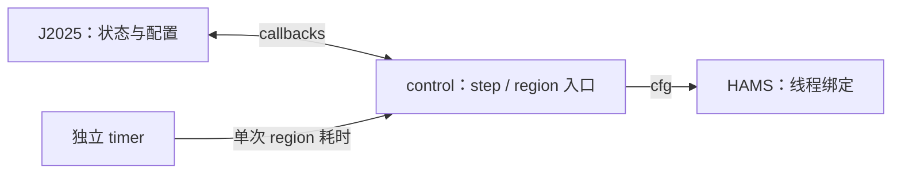

# Region control 框架

通用控制层。框架模块为 [HAMS](../hams/README.md)、本目录和独立的 [timer](../timer/README.md)；
[J2025](../../J-2025.md) 是算法部件，NPB SP 和 [example](../../example/README.md) 是应用。



| 模块 | 职责 |
| --- | --- |
| J2025 | 保存 `state[region_id]`，推进搜索，生成含 mask 和升序 `tid_to_cpu` 的 cfg |
| control | 注册一组 callback/context，管理一个共享 HAMS binding，转发 step/region 事件 |
| HAMS | 应用 cfg，相同配置跳过重复绑定 |
| timer | 读取时间、累计耗时、输出报告；向 control 提供本次 region 耗时，不依赖任何应用 |

统一 callback，其他 tuning 方法实现同一组接口并调用 `region_control_register()` 即可：

| Callback | 功能 |
| --- | --- |
| `step_start(ctx, t)` | 通知第 t 次 iteration 开始；不读时间 |
| `select_cfg(ctx, id)` | 返回本次 region 的完整 cfg |
| `observe(ctx, id, seconds)` | 接收单次耗时，更新该 region 的算法状态 |
| `step_finish(ctx, t)` | 通知本次 iteration 结束；不读时间 |

调用顺序（示意）：

```c
/* 冷启动：捕获 MAX_THREADS，创建共享 binding，注册算法 callback。 */
for (t in time_steps) {
    control_step_start(t);           /* 仅通知 callback */

    /* 每个外层 parallel / parallel for 均执行下面这一组。 */
    control_region_start(id);        /* select_cfg -> HAMS apply */
    /* 原 timing begin -> 原 parallel 执行一次 -> 原 timing end，取得 elapsed */
    control_region_finish(id, elapsed); /* observe */

    /* 后续 region ... */
    control_step_finish(t);          /* 仅通知 callback */
}
```

接口见 [region_control.h](region_control.h)。调用方拥有算法 context；control 只管理共享 binding。
NPB 的薄 C 接口在 [region_control_adapter.h](../../NPB3.3-OMP-C/common/region_control_adapter.h)，J2025 实现位于 [j2025/](../j2025/j2025.cpp)。

构建与测试（benchmark 根目录）：

```sh
make -C example run
make -C framework/timer test
make -C NPB3.3-OMP-C control-test CC=clang-18
make -C NPB3.3-OMP-C TUNER=j2025 CLASS=S CC=clang-18 CLANG=clang-18
env -u OMP_PLACES -u KMP_AFFINITY -u GOMP_CPU_AFFINITY \
    OMP_PROC_BIND=false OMP_DYNAMIC=false OMP_NUM_THREADS=8 \
    NPB_TIME_REPORT=1 ./NPB3.3-OMP-C/bin/SP.S
```

`TUNER=none` 为默认原始模式；`NPB_TIME_REPORT=0` 只关闭报告，调优仍执行。
使用 GNU runtime 时改为 `CC=gcc`，C++ 编译器默认随 `CC` 选择，也可显式指定 `CXX=g++`。
独立 UT：`make -C framework/region_control test`、`make -C framework/j2025 test`。

实现约定：

- `MAX_THREADS` 在首次绑定前捕获一次；region 状态跨 step 保留。step callback 当前可为空，不重置搜索。
- J2025：首次调用 warmup → TM_SEARCH → Fibonacci NT_SEARCH（`2, 4, ..., MAX_THREADS`）→ STABLE；每完成一次 region 调用推进搜索，STABLE 固定使用收敛 cfg。
- `best_TM` 简单保留最小耗时对应策略；接受满线程 CLOSE/SCATTER 绑定相同。方差判断和 NUMA balancing 留 TODO 空函数。
- 初版使用系统 CPU ID `0..MAX_THREADS-1`：CLOSE 为 `cpu=tid`，SCATTER 为 `cpu=tid*MAX_THREADS/nt`。`MAX_THREADS` 须为不超过 `HAMS_CPU_COUNT` 的正偶数，所有所选 CPU 可绑定；页面布局沿用应用初始化结果。
- STABLE 的 region 仍提交自己的 cfg；所有 region 共用一个 binding，保证 `A -> B -> A` 正确恢复配置。
- control 不读取时间。timing 的单次样本交给算法，累计值用于报告；绑定与 callback 开销在 region 样本外。
- step 入口手工放在正式迭代循环体首尾，正常结束路径成对调用；保留现有总计时窗口，不嵌套调用 `npb_time_begin/end`。
- region 入口复用现有插桩和 ID；内部 `omp for` / nowait 保持原 timing。关闭报告仍可调优，首版要求 `INSTRUMENT=1`。
- NPB 通过薄 C 接口调用 control，control/J2025/HAMS 使用 C++；只接受有效配置，错误使用 assert。
- NPB SP 和独立 example 通过各自入口使用同一套 framework 模块。
